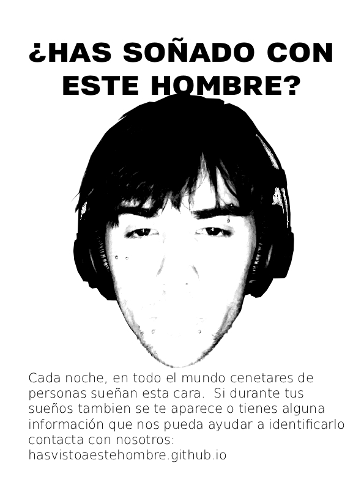

<!DOCTYPE html>
<html lang="es">
<head>
<meta charset="UTF-8">
<meta name="viewport" content="width=device-width, initial-scale=1.0">
<title>¿Has visto a este hombre?</title>

</head>
<body>
    <h1>¿HAS VISTO A ESTE HOMBRE?</h1>
    
    

        Este hombre fue visto por última vez en el centro de la ciudad.
        Si tienes información, contáctanos a través de los enlaces:
    

    

        <a href="https://www.instagram.com/da.realfancy?igsh=aHExYjR5eHQ5OTlt&utm_source=qr" target="_blank" rel="noopener noreferrer">Instagram</a>
        <a href="https://www.youtube.com/watch?v=43MC9-vojVY" target="_blank" rel="noopener noreferrer">YouTube</a>
        <a href="https://soundcloud.com/fancy616" target="_blank" rel="noopener noreferrer">SoundCloud</a>
        <a href="https://x.com/fancybadluck" target="_blank" rel="noopener noreferrer">Twitter / X</a>
    

    <footer>hasvistoaestehombre.github.io</footer>
</body>
</html>
